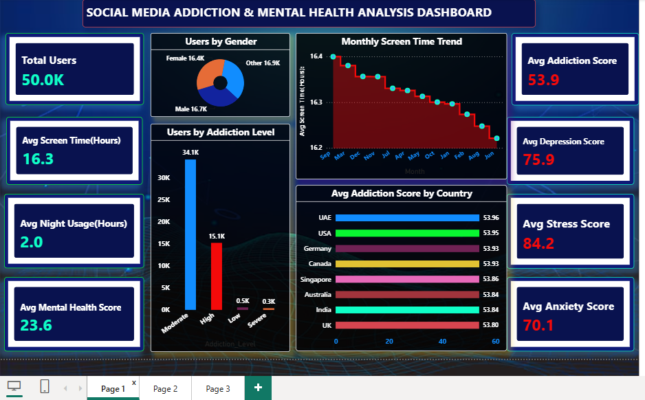
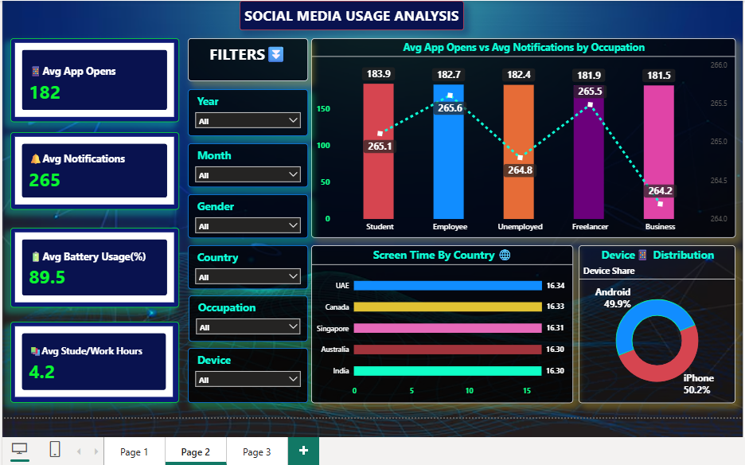

# 📊 Social Media Addiction & Mental Health Analysis Dashboard


## 📌 Project Overview

This Power BI dashboard analyzes **50,000 social media users** to understand the relationship between social media usage, addiction levels, screen time, mental health, engagement patterns, and user demographics.

The dashboard provides interactive insights into user behavior, allowing stakeholders to identify trends across countries, occupations, devices, gender, and social media platforms.

---

# 🎯 Project Objectives

- Analyze overall social media usage.
- Measure addiction levels among users.
- Compare mental health indicators.
- Identify platform-wise engagement.
- Explore country-wise usage patterns.
- Build an interactive Power BI portfolio project.

---

# 📁 Dataset Information

**Dataset:** Social Media Addiction Dataset

**Records:** 50,000+

The dataset contains information such as:

- User ID
- Age
- Gender
- Country
- Occupation
- Device Type
- Screen Time
- Night Usage
- Addiction Score
- Depression Score
- Anxiety Score
- Stress Score
- Mental Health Score
- App Opens
- Notifications
- Battery Usage
- Study/Work Hours
- Instagram Usage
- Facebook Usage
- WhatsApp Usage
- YouTube Usage

---

# 🛠 Tools Used

- Microsoft Power BI
- Power Query
- DAX
- Data Modeling
- Custom Theme
- Interactive Filters & Slicers

---

# 📈 Dashboard Features

### Executive Overview

- Total Users
- Average Screen Time
- Average Night Usage
- Mental Health Score
- Addiction Score
- Depression Score
- Anxiety Score
- Stress Score
- Monthly Screen Time Trend
- Addiction Level Distribution
- Gender Distribution
- Country-wise Addiction Analysis

---

### Social Media Usage Analysis

- Average App Opens
- Average Notifications
- Battery Usage
- Study/Work Hours
- Occupation-wise Usage
- Screen Time by Country
- Device Distribution
- Interactive Filters

---

### User Engagement & Platform Analysis

- Instagram Usage
- Facebook Usage
- WhatsApp Usage
- YouTube Usage
- Platform-wise Average Hours
- Country-wise Depression Score
- Mental Health by Gender

---

# 📊 Key Insights

- Average screen time is approximately **16.3 hours/day**.
- Moderate addiction represents the largest user group.
- Mental health indicators remain relatively consistent across genders.
- YouTube has the highest average usage among selected platforms.
- App opens and notifications vary significantly by occupation.
- Screen time remains similar across the analyzed countries.
- Addiction score averages around **54**, indicating moderate overall dependency.

---

<========== 📷 Dashboard Screenshots ==========>

## 🏠 Page 1 – Executive Dashboard..!



---

## 📊 Page 2 – Social Media Usage Analysis..!



---

## 📈 Page 3 – User Engagement & Platform Analysis..!


---

# 📌 Power BI Features Used

- KPI Cards
- Line Chart
- Area Chart
- Clustered Column Chart
- Donut Chart
- Pie Chart
- Bar Chart
- Interactive Slicers
- Drill Filters
- DAX Measures
- Custom Theme
- Bookmarks & Navigation

---

<----- 🚀 Business Value ----->

This dashboard helps organizations and researchers to:

- Understand user engagement behavior.
- Monitor digital addiction trends.
- Compare countries and occupations.
- Analyze mental health indicators.
- Support data-driven decision-making.

---

# 📂 Repository Structure

```
Social-Media-Addiction-Dashboard
│
├── Dashboard.pbix
├── Dataset.csv
├── README.md
├── Screenshots
│   ├── Social_Media_PG_1.png
│   ├── Testing_Data_Analyse_PG_1.png
│   ├── Social_Media_PG_2.png
│   ├── Testing_Data_Analyse_PG_2.png
│   ├── Social_Media_PG_3.png
│   └── Testing_Data_Analyse_PG_3.png
```

---

# 👨‍💻 Author

**Avi Saini**

BCA Student | Data Analyst Aspirant

LinkedIn: https://www.linkedin.com/in/avi-saini-15956b214

GitHub: 

---

## ⭐ If you found this project useful, don't forget to Star this repository! Thanks..!
